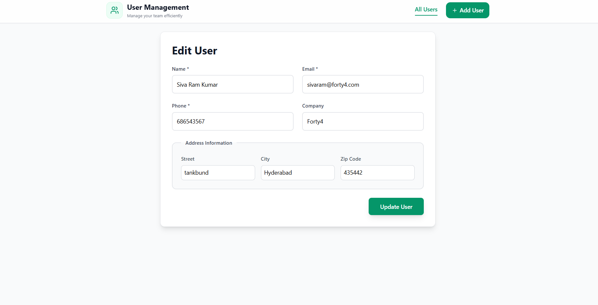
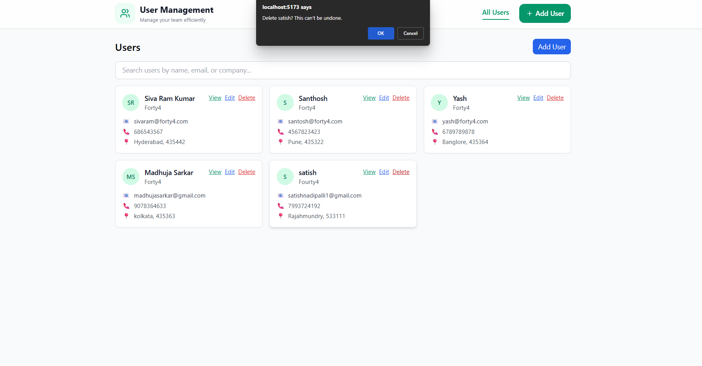

# User Management Dashboard

A full-stack CRUD web app built with **React + Vite** (frontend) and **Node.js/Express + MongoDB/Mongoose** (backend).  
Includes client/server validation, RESTful APIs, and a responsive Tailwind UI.

## Features
- List, create, view, edit, and delete users
- Client-side validation (required fields, email format)
- Server-side validation with helpful errors
- Clean, responsive UI (Tailwind CSS)
- Organized folder structure and modular code

## Tech Stack
- **Frontend**: React (functional components + hooks), React Router, Axios, Vite, Tailwind CSS
- **Backend**: Node.js, Express.js, Mongoose
- **Database**: MongoDB


## Getting Started

### 1) Backend
```bash
cd server
cp .env.example .env
# edit .env to set MONGODB_URI and PORT
npm install
npm run dev
```
By default it runs at `http://localhost:5000`.

### 2) Frontend
Open a new terminal:
```bash
cd client
npm install
npm run dev
```
Vite will print a local dev URL, typically `http://localhost:5173`.

### 3) Connect Frontend to Backend
The frontend uses `VITE_API_BASE_URL` from `client/.env` (falls back to `http://localhost:5000/api`).
Create `client/.env` if you need to override:
```
VITE_API_BASE_URL=http://localhost:5000/api
```

## API Endpoints
- `GET /api/users` — list all users
- `GET /api/users/:id` — get single user
- `POST /api/users` — create user
- `PUT /api/users/:id` — update user
- `DELETE /api/users/:id` — delete user

### User Schema
```js
{
  name: string,
  email: string,
  phone?: string,
  company?: string,
  address?: {
    street?: string,
    city?: string,
    zip?: string,
    geo?: { lat?: number, lng?: number }
  }
}
```

## Scripts
- **server**: `npm run dev` (nodemon) / `npm start`
- **client**: `npm run dev` / `npm run build` / `npm run preview`

## Notes
- Includes graceful error responses (404, 400, 500)
- Email uniqueness enforced at DB level + validated in code
- Minimal, clean layout with Tailwind + accessible form controls

## Screenshots (add yours)
- Dashboard list
- Create/Edit form
- Detail page

---


## Screenshots

### Create User


### Edit User


### Update User


### View User


### After a user gets deleted


### Asking the admin to recheck while deleting


### Resposive screens


